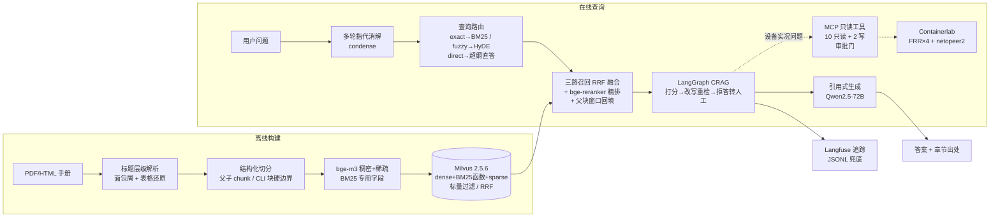

# netops-rag

**面向网络设备的可溯源智能问答与排障辅助系统（Agentic RAG）**：自然语言提问返回带手册章节出处的答案，跨厂商/跨版本手册统一检索（华为 V600R024/025、思科 IOS XE 17.9、H3C R1110），并可联动 Containerlab 仿真设备执行只读实况诊断与受控审批写操作。所有评测数字均由仓库内脚本生成、可一行复现。

> 当前语料规模：221 文档 / 14,425 页 → 43,950 hybrid chunks（12,243 父块 + 31,707 子块）+ 18,946 naive chunks（见 [docs/reports/pdf-ingest-v1-report.md](docs/reports/pdf-ingest-v1-report.md)）。

## 架构



- **检索**：Milvus 2.5.6 standalone 单库承载稠密（bge-m3）+ 内置 BM25 函数 + bge-m3 稀疏三路召回，RRF 融合，bge-reranker-v2-m3 精排，父子 chunk（子块检索、父块整节回填生成），型号/软件版本标量过滤下推。
- **Agent**：LangGraph CRAG 状态机——检索结果 LLM 打分（1-10），低分改写重检一轮，仍低分拒答转人工（handoff）；查询类型路由（exact/fuzzy/direct）；多轮指代消解；诊断类问题经 MCP 只读工具取设备实况。
- **工具链**：FastMCP 12 个原子工具（10 只读 + 2 写），写操作走审批门 + 幂等 + 配置快照回滚。
- **服务**：FastAPI（`/ask` `/diagnose` `/approvals`），Langfuse 可插拔观测，RAGAS judge 可切换。

## 三场景演示

> 以下输出均为**格式示意**（结构真实、内容为占位），完整真实输出见各评测报告与 [docs/demo.md](docs/demo.md)。

### 场景 1：可溯源问答（ask.py）

```bash
uv run python scripts/ask.py "在 Catalyst 9300 上如何配置 VLAN?" --retriever hybrid
```

```text
[retriever: hybrid]
<基于检索片段的引用式回答，答案末尾带【出处】编号>
……（示意）

出处：
 [1] <章节面包屑>（cisco-c9300-17.9-vlan-cg）
 [2] <章节面包屑>（hw-v600r025c00-eth-switch-01-04）
[trace: data/traces/xxx.jsonl]
```

每条答案逐句标注出处编号，出处为「章节面包屑 + doc_id」，可回溯到手册具体章节。`--retriever naive` 可切换纯稠密对照基线。

### 场景 2：跨版本过滤问答（华为 V600R024C10 vs V600R025C00）

问句中的型号别名自动下推为标量过滤（`ask.py` 的 `detect_filter`）；版本题在评测中对所有检索器对称应用 `sw_version` 过滤。实测（15 条版本题子集，n=15，[报告](docs/eval-reports/2026-09-06-s3-retrieval.md)）：

| 配置 | chunk-id R@5 | doc R@5 |
|---|---|---|
| hybrid + 版本过滤 | **0.800** | **0.933** |
| hybrid 无过滤（诊断行） | 0.667 | 0.867 |

```bash
uv run python scripts/ask.py "在华为 V600R025C00 上，配置端口隔离后同一端口组内的接口还能互访吗?"
```

```text
[retriever: hybrid]
<仅引用 V600R025C00 对应卷章节的回答>（示意）
出处：
 [1] > 以太网交换 > 端口隔离 > …（hw-v600r025c00-eth-switch-01-xx）
```

### 场景 3：容器实况诊断（/diagnose + MCP 工具链）

诊断类问题由 LangGraph CRAG 的 `tools=True` 图处理：零 LLM 的关键词启发式命中设备实况问题后，经 ToolsGateway（只读白名单）调 FastMCP 工具从 Containerlab 拓扑取**真实设备状态**，工具输出与检索片段一起进生成。写操作永不自动执行——`/diagnose` 至多给出变更计划提案，执行须走审批门。

```bash
make lab-up                          # 部署 FRR×4 + netopeer2 仿真拓扑
uv run python scripts/run_server.py  # FastAPI，默认 127.0.0.1:8000

curl -s -X POST localhost:8000/diagnose -H 'Content-Type: application/json' \
  -d '{"question": "看下 core1 的 OSPF 邻居状态", "host": "core1"}'
```

```json
{
  "answer": "<结合设备实况与手册的回答>（示意）",
  "citations": ["[1] <章节面包屑>（doc_id）"],
  "tool_outputs": [{"tool": "show_ospf_neighbor", "args": {"host": "core1"}, "output": "<vtysh 真实回显>"}],
  "handoff": false,
  "route": null,
  "trace_id": "…"
}
```

## 快速开始

**前置要求**：NVIDIA GPU（≥16G 显存跑 bge-m3 + reranker 本地推理）、Docker（含 compose）、[uv](https://docs.astral.sh/uv/)、Python 3.11。

```bash
git clone <repo-url> && cd netops-rag
make setup          # uv sync + cp -n .env.example .env
```

编辑 `.env`：`SILICONFLOW_API_KEY` 必填（生成 LLM）；可选 `LANGFUSE_*`（观测，缺省自动降级本地 JSONL）、`DEEPSEEK_API_KEY`+`DEEPSEEK_MODEL`（RAGAS judge 换异构模型）、`APPROVE_SECRET`（审批 API 密钥门）。

```bash
make milvus-up      # Milvus 2.5.6 standalone（deploy/docker-compose.milvus.yml）
make models         # 下载 bge-m3 / bge-reranker-v2-m3（走 HF_ENDPOINT=hf-mirror）
# 全量入库：ground-truth markdown（data/processed_pdf/，238 个 .md）已随仓库提交，
# --reuse-md 直接从 md 重建索引，无需 650MB 原始 PDF
uv run python scripts/ingest_pdf.py --manifest data/manifests/pdf_v1.yaml --reuse-md
make test           # 单测（283 passed，排除 milvus/gpu/lab 标记用例）
```

生成/抓取/评测等 CLI（其余均支持 `--help`；例外：`gen_pdf_manifest.py` / `download_models.py` 无 argparse 参数解析、直接执行，勿随手试跑）：

| 命令 | 用途 |
|---|---|
| `scripts/ask.py` | 可溯源问答（`--retriever hybrid\|naive`） |
| `scripts/ask_crag.py` | CRAG 问答：打分/改写/拒答、`--route` 查询路由、`--history` 多轮指代消解 |
| `scripts/ingest_pdf.py` | PDF 摄取全链路（转换→切分→嵌入→双 collection 入库） |
| `scripts/build_index.py` | 旧 HTML 语料索引（`--mode naive\|hybrid`） |
| `scripts/run_s3_eval.py` | 检索三层口径评测（生成 docs/eval-reports 报告） |
| `scripts/run_ragas.py` | RAGAS 四指标（`--judge deepseek\|siliconflow --assembly child-chunks\|parent-window --gen-cache`） |
| `scripts/build_golden_s3.py` | golden set 构建（`--dry-run` 不调 LLM） |
| `scripts/run_server.py` | FastAPI 服务 |
| `scripts/fetch_docs.py` / `gen_pdf_manifest.py` / `download_models.py` | 抓取 / 白名单清单 / 模型下载 |

**Containerlab 仿真拓扑**（FRR×4 + netopeer2，`make lab-up/lab-down/lab-inspect`）：containerlab 以特权容器运行（兼容 Docker Desktop 形态）；`netopeer2` 镜像经 `docker.1ms.run` 镜像拉取（`make lab-pull`），containerlab 二进制经 ghproxy 下载（`make clab-runner`，失败有清晰报错与手动放置指引）。

**网络受限环境说明**（均已内置处理，如实记录）：

- docker.io 不可直连 → 配置 Docker registry-mirrors（如 daocloud.io / docker.1ms.run）；Milvus compose 的 etcd 来自 quay.io 可直连。
- HuggingFace → `.env` 已预设 `HF_ENDPOINT=https://hf-mirror.com`。
- 思科 docs 抓取需 TLS 指纹伪装 → `fetcher.py` 已内置 curl_cffi chrome impersonation。
- GitHub 下载受限 → Makefile 内 containerlab tarball 走 ghproxy.net / gh-proxy.com 双源。

## 评测摘要

全部数字出自已提交的脚本生成报告（[docs/eval-reports/](docs/eval-reports/)），口径设计（三层判据/拒答两层/TOC 缺陷案例）见 [docs/eval-design.md](docs/eval-design.md)。

**检索（golden 200 条四类，非拒答 n=170，k=5，TOC 修复后）**——[报告](docs/eval-reports/2026-09-06-s3-retrieval.md)：

| 配置 | chunk-id R@5 | doc R@5 |
|---|---|---|
| naive（文本重叠判据） | 0.806 | 0.806 |
| hybrid 三路（dense+BM25+sparse, RRF） | 0.712 | 0.841 |
| hybrid + bge-reranker 精排 | 0.776 | **0.888** |

- 拒答题内容重叠层（越低越好，可证伪口径）：naive 0.433 / hybrid 0.033 / +rerank 0.067。
- 评测集质量机制：出题溯源到 chunk、grounding 审计、全量 QC 台账、TOC 目录页缺陷发现与修复（11 条坏题重指，chunk 级 +3.5/+1.8/+3.5pt、doc 级持平）——详见 [eval-design §4](docs/eval-design.md)。

**RAGAS faithfulness 验证序列**（50 条分层抽样 seed=42，单变量逐步，[Run A](docs/eval-reports/2026-09-06-s3-ragas-runA-deepseek-judge.md) / [Run B](docs/eval-reports/2026-09-06-s3-ragas-runB-parent-window.md)）：

| 轮 | 变量 | faithfulness |
|---|---|---|
| T6 基线 | Qwen2.5-72B judge，child-chunks 装配 | 0.654 |
| Run A | judge 换 DeepSeek（+0.098，judge 效应） | 0.752 |
| Run B | contexts 装配改父块窗口（+0.049，装配效应） | **0.801** |

**复现命令**（需 Milvus + GPU + 模型 + `.env` 密钥）：

```bash
uv run python scripts/run_s3_eval.py    # 检索三层口径 → docs/eval-reports/
uv run python scripts/run_ragas.py --sample 50 --judge deepseek \
    --assembly parent-window            # 生成缓存 data/llm_cache/（gitignore，不共享时首次全量生成）
```

迭代史（S1 小语料基线 → S2 naive 反超与 BM25 噪声消融诊断 → PDF 语料扩容反转消失 → TOC 缺陷修复）每轮的数字、诊断与解法：[eval-design §6](docs/eval-design.md)。

## 仓库结构

```
netops-rag/
├── scripts/                 # CLI：抓取/摄取/索引/问答/评测/服务（见上表）
├── src/netrag/
│   ├── ingestion/           # PDF/HTML→md（面包屑/表格/页眉脚处理）、父子 chunk、BM25 字段
│   ├── embedding/           # bge-m3（稠密+稀疏一次推理）、bge-reranker 封装
│   ├── index/               # Milvus schema（hybrid 三路 + naive 对照）与 collection 管理
│   ├── retrieval/           # Naive / Hybrid（RRF+精排+父块回填）/ 路由包装
│   ├── agent/               # LangGraph CRAG：打分/改写/拒答、condense、查询路由、diagnose
│   ├── tools_mcp/           # FastMCP 12 工具、审批门、网关只读白名单、设备适配
│   ├── generation/          # 引用式生成、父块窗口装配
│   ├── eval/                # golden set、Recall@K/MRR、RAGAS、报告生成
│   ├── observability/       # Langfuse / JSONL 可插拔 Tracer
│   └── api/                 # FastAPI：/ask /diagnose /approvals
├── deploy/
│   ├── docker-compose.milvus.yml
│   └── containerlab/        # FRR×4 + netopeer2 拓扑即代码、clab-runner 镜像
├── data/
│   ├── processed_pdf/       # ground-truth markdown（238 个 .md，入 git，可重建索引）
│   ├── manifests/           # 语料白名单（vendor/model/sw_version/volume/doc_id）
│   └── golden/              # 评测集 s1/s2/s3_full.yaml（200 条四类）
├── docs/
│   ├── eval-design.md       # 口径设计 + TOC 缺陷案例 + 数字迭代史
│   ├── eval-reports/        # 6 份脚本生成的评测报告（数字证据链）
│   ├── reports/             # PDF 摄取管线 v1 报告
│   └── demo.md              # 3 分钟现场演示脚本
└── tests/                   # pytest（unit / milvus / gpu / lab 分层标记）
```

## 安全设计

写操作（配置下发/回滚）设四道闸，读改写路径分离：

1. **只读白名单**：Agent 侧 ToolsGateway 仅暴露 10 个只读工具（`READONLY_TOOLS` 强制）；`push_config`/`restore_snapshot` 永不经过网关，Agent 无法自动下发配置。
2. **审批门**：写工具须持一次性 token（request → 人工 approve 才生成）；token 与登记的 **(host, 变更计划)** 强绑定——A 设备良性变更的 token 拿去 B 设备或改行下发即拒绝；token 只存 sha256，明文仅 approve 返回一次；审批日志 JSONL 追加式（`data/approvals.jsonl`），读改写全程 `fcntl.flock` 互斥防双花。
3. **APPROVE_SECRET 密钥门**：`POST /approvals/{id}/approve` 可配共享密钥头（`X-Approve-Secret`，常量时间比较防时序侧信道）；`run_server.py` 非回环绑定时打印安全警告。
4. **幂等 + 快照回滚**：下发前逐行与 running 比对（已存在则 no-op）；变更前快照 running，默认 60s commit-confirmed 窗口到期自动回滚，窗口内二次调用 `confirm_transaction=True` 才持久化。

## 已知限制（如实记录）

- **中文问题 × 英文语料的 BM25 噪声**：S2 消融实测 BM25 单路 chunk R@5 仅 0.146（中文题与英文命令字段几乎无词法交集），三路等权融合曾把 dense 单路 0.689 拖低到 0.583——已由查询路由缓解（BM25 仅对 exact 类命令查询激活），未做跨语言检索优化。
- **naive 在本 golden set 上天然强**：题目由期望 chunk 原文生成，naive 大窗口靠词面重叠轻易命中（S2 曾反超 hybrid 0.961 vs 0.583；语料扩容到 221 文档后 doc 级反转消失，chunk 级 naive 0.806 仍高于 hybrid 0.712）——对比必须带判据标注（naive 的 chunk 级为文本重叠口径，与 hybrid 严格 id 判据不混排）。
- **RAGAS 英文 prompt × 中文语料未校准**：faithfulness/语句分类的绝对值只作相对对比（跨迭代基线），不与公开英文 benchmark 可比；【出处】脚注行会被陈述拆分计为无据句，系统性压低短答案分数（Run B 归因 7/7 已定量实证）。
- **启动前目标口径的 67% 起点在任何已测配置下不存在**；88% 终点与 doc 级 hybrid+rerank 实测 0.888 吻合。处置与候选方案见 [eval-design §6](docs/eval-design.md)。
- **语料固有缺口**：思科侧为 4 本整书配置指南（无故障处理卷），troubleshoot 题支撑弱于华为；2 条 multihop 次分块为薄 Feature History 段（已披露待改）。
- **主机名提取启发式局限**：型号词（如 S5735）可能被误判为 host；API 层显式传 `host` 优先。
- **生成缓存不入 git**（`data/llm_cache/`）：RAGAS 复现若无缓存首次全量生成（50 条 LLM 调用）；DeepSeek judge 为推理型计费，Run A+B 两轮实测 ≈¥17。

## 文档索引

| 文档 | 内容 |
|---|---|
| [docs/eval-design.md](docs/eval-design.md) | 三层判据口径设计、拒答可证伪两层、golden set 质量机制、TOC 缺陷案例、数字迭代史、RAGAS 迭代方案 |
| [docs/eval-reports/](docs/eval-reports/) | S1 基线 / S2 对比消融 / S3 检索 / RAGAS 基线与 Run A/B 共 6 份脚本生成报告 |
| [docs/reports/pdf-ingest-v1-report.md](docs/reports/pdf-ingest-v1-report.md) | PDF 摄取管线 v1：238 文档白名单、解析/切分实现、入库统计与耗时 |
| [docs/superpowers/specs/2026-09-04-netops-rag-design.md](docs/superpowers/specs/2026-09-04-netops-rag-design.md) | 系统设计文档（背景、选型、数据流、存储、评测分层） |

## License

MIT（占位，正式 LICENSE 文件待补）。
